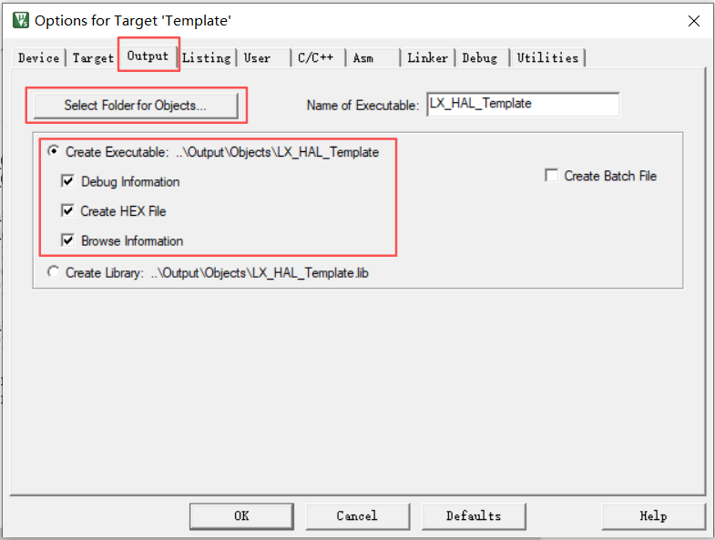
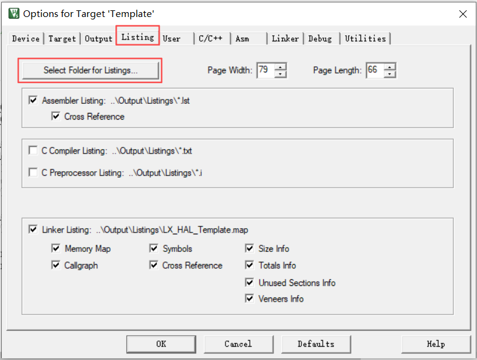
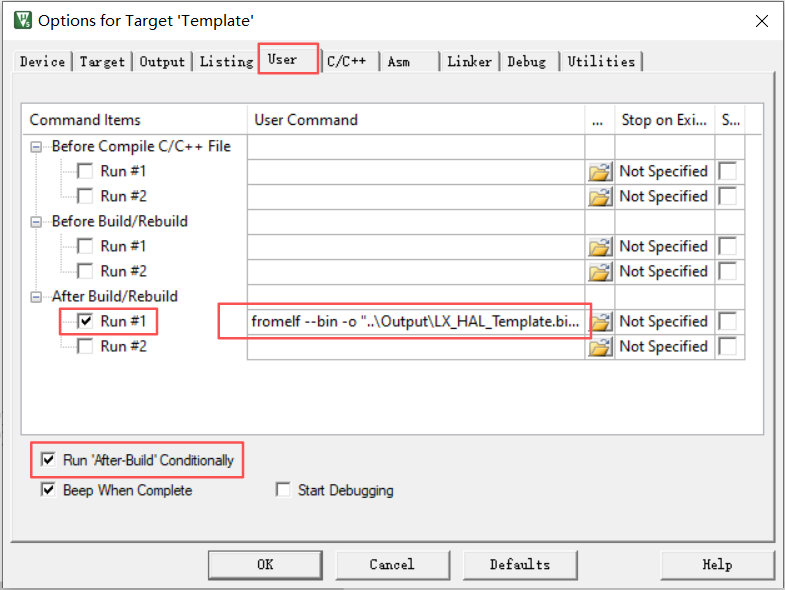

# 目录结构规范（中文版）

本文档定义单工程 `MCU + Keil` 项目的标准本地目录结构和 `Keil` 工程分组结构，适用于 RTOS 和无 RTOS 两类项目。

## 基础本地目录结构

```text
App/
  function/
  User_Config/
  main.c
BSP/
  board/
  devices/
Common/
  User_System/
  utilities/
Docs/
Drivers/
Output/
  Listings/
  Objects/
  Bin/
Project/
  Keil-MDK/
```

- `App/tasks/` 只在 RTOS 工程中存在。
- `Middlewares/FreeRTOS/` 只在 RTOS 工程中存在。

## 基础 Keil 工程分组结构

```text
项目名
├─System
├─App/User
├─App/function
├─Common
├─BSP/board
├─BSP/devices
├─Drivers/xx32xx_Driver
└─...
```

- 这是 RTOS 与无 RTOS 工程共享的基础分组。
- RTOS 工程只是在此基础上增加 `App/tasks` 和 `Middlewares/FreeRTOS`。
- `Keil` 分组是虚拟分组，不要求与本地目录完全同名。

## RTOS 工程本地目录结构

```text
App/
  function/
  tasks/
  User_Config/
  main.c
BSP/
  board/
  devices/
Common/
  User_System/
  utilities/
Docs/
Drivers/
Middlewares/
Output/
  Listings/
  Objects/
  Bin/
Project/
  Keil-MDK/
```

一个更展开的 RTOS 目录示例如下：

```text
├─App
│  ├─function
│  ├─tasks
│  ├─User_Config
│  └─main.c
├─BSP
│  ├─board
│  └─devices
│     ├─led
│     └─sensors
├─Common
│  ├─User_System
│  └─utilities
├─Docs
├─Drivers
│  ├─CMSIS
│  ├─xx32xx_Driver
│  │  ├─inc
│  │  └─src
│  └─xx32xx_System
├─Middlewares
│  └─FreeRTOS
├─Output
│  ├─Listings
│  ├─Objects
│  └─Bin
└─Project
   └─Keil-MDK
```

## 各目录职责

- `App`
  - 应用层。
  - 存放程序入口、任务、业务流程、状态机等。
  - `function/`：存放业务功能代码，也可以放已经带业务逻辑的外设开发代码。
  - `tasks/`：仅用于 RTOS 任务代码。
  - `User_Config/`：存放用户自定义配置文件，可包含运行时和编译时配置 `.c/.h`。
  - `main.c`：应用入口函数。

- `BSP`
  - 板级支持包。
  - `board/`：存放板级外设支持代码，例如 `bsp_gpio.c`、`bsp_adc.c`。
  - `devices/`：存放用户自己写的外设硬件控制代码，但不包含业务逻辑，例如 `led`、`motor`、`encoder`、`sensor`。

- `Common`
  - 工程公共系统胶水与共享代码。
  - `User_System/`：存放 `xx_it.c/h`、`interrupts_xx32xx.c/h`、`systick.c/h` 等系统级公共文件。
  - `utilities/`：存放工具类代码，例如 `crc16.c/h`、`ring_buffer.c/h`。

- `Docs`
  - 存放工程相关文档。

- `Drivers`
  - 存放芯片厂商、CMSIS、底层驱动和设备支持文件。
  - `CMSIS/`：CMSIS 相关文件。
  - `xx32xx_Driver/`：官方提供的底层外设驱动库。
  - `xx32xx_System/`：芯片/厂商支持系统文件，例如 `hc32l19x.h`、`stm32f1xx.h`、`system_xxx.c`。

- `Middlewares`
  - 存放第三方中间件源码。
  - `FreeRTOS/`：RTOS 源码及 `FreeRTOSConfig.h`。

- `Output`
  - 存放编译产物。
  - `Listings/`：`.map`、`.lst` 等文本分析文件。
  - `Objects/`：`.o`、`.axf`、`.hex` 等编译产物。
  - `Bin/`：通过 `fromelf` 转换得到的 `.bin` 文件。

- `Project`
  - 存放工程文件与工具链相关文件。
  - `Keil-MDK/`：存放 `uvprojx`、启动文件、`.sct` 等 Keil 相关内容。

## 系统相关文件放置规则

- `startup_xxx.s`、`.sct`
  - 放在 `Project/Keil-MDK/`
  - 这类文件属于工具链相关文件，不属于通用源码。

- `hc32l19x.h`、`stm32f1xx.h`、`core_cm*.h`、`system_xxx.c`
  - 放在 `Drivers/xx32xx_System/`
  - 如果原始工程已经将这类文件放在 `Drivers/CMSIS/` 内，则保持原位置即可。

- `xx_it.c`、`xx_it.h`
  - 放在 `Common/User_System/`
  - 它们属于工程级中断接线文件，通常会被用户修改。

- `systick.c`、`systick.h`
  - 放在 `Common/User_System/`
  - 它们通常是用户自己写的系统节拍、延时、超时封装。

## RTOS 工程的 Keil 分组建议

```text
项目名
├─System
│  ├─startup_xx32xx.s
│  ├─stm32f1xx.h
│  ├─system_xxx.c
│  ├─xx32xx_it.c
│  └─...
├─App/User
│  ├─configure.c
│  └─main.c
├─App/tasks
│  ├─key_task.c
│  ├─uart_task.c
│  └─...
├─App/function
│  ├─key_func.c
│  ├─uart_func.c
│  └─...
├─Common
│  ├─crc16.c
│  ├─ring_buffer.c
│  └─...
├─BSP/board
│  ├─bsp_gpio.c
│  ├─bsp_adc.c
│  └─...
├─BSP/devices
│  ├─motor.c
│  ├─encoder.c
│  └─...
├─Drivers/xx32xx_Driver
│  ├─stm32f1xx_gpio.c
│  ├─stm32f1xx_adc.c
│  └─...
├─Middlewares/FreeRTOS
│  ├─list.c
│  ├─heap_4.c
│  └─...
```

补充说明：

- `System` 组中放启动文件，以及 `Drivers/xx32xx_System` 和 `Common/User_System` 下的系统文件。
- `Common` 组只放 `Common/utilities` 下的工具类源码。
- `App/tasks` 只有在使用 RTOS 且任务较多时才建议单独建组。

## 无 RTOS 工程本地目录结构

无 RTOS 工程沿用基础目录，只移除 RTOS 专属目录：

```text
App/
  function/
  User_Config/
  main.c
BSP/
  board/
  devices/
Common/
  User_System/
  utilities/
Docs/
Drivers/
Output/
  Listings/
  Objects/
  Bin/
Project/
  Keil-MDK/
```

- 不创建 `App/tasks/`
- 不创建 `Middlewares/FreeRTOS/`
- `main.c` 初始化后直接进入 `while(1)` 主循环或事件循环
- 裸机工程的业务逻辑仍主要放在 `App/function/`

## 无 RTOS 工程的 Keil 分组建议

```text
项目名
├─System
├─App/User
├─App/function
├─Common
├─BSP/board
├─BSP/devices
├─Drivers/xx32xx_Driver
└─...
```

- 不创建 `App/tasks`
- 不创建 `Middlewares/FreeRTOS`

## 编译输出规范

- `Objects`
  - 存放 `.o/.axf/.hex` 等文件。
  - 设置方式：
    

- `Listings`
  - 存放 `.map/.lst` 等分析文件。
  - 设置方式：
    

- `Bin`
  - 存放通过 `fromelf` 生成的 `.bin` 文件。
  - 由于 Keil 不直接输出 `.bin`，需要在 After Build 中添加类似命令：
    ```text
    fromelf --bin -o "..\Output\ProjectName.bin" "..\Output\Objects\ProjectName.axf"
    ```
  - 设置方式：
    
  - 这样做的好处是：
    - 可以把 `Objects/`、`Listings/` 作为中间产物统一忽略。
    - 如果项目流程需要保留烧录文件，可以仅保留 `Bin/` 下的 `.bin`。

## 编译工具发现与编译验证

- 在实际修改前，先询问用户 Keil 编译工具是否已经加入系统 `PATH`。
- 如果用户回答“是”，不要直接假设可用，必须先在 PowerShell 中用 `Get-Command UV4.exe` 检查；必要时继续检查 `UV5.exe`、`uvision.exe` 等其他可能的 Keil 可执行文件名，以确认真实路径。
- 如果用户回答“否”，则必须要求用户提供编译工具目录或可执行文件的绝对路径，并给出示例路径，例如 `D:\ruanjian\keil5-MDK-ARM\UV4\`，但不要假设用户的工具一定就是 `UV4`。
- 在重组完成后，只要环境支持命令行执行，就应基于已确认的编译工具路径做一次编译验证。

## 用户交互检查项

在实际执行前，下列信息属于必须确认项。如果运行环境支持结构化选择框，应优先使用可点击选项，而不是自由输入：

1. 是否为单工程 Keil 工程
   - 继续
   - 退出
2. 是否确认继续执行，并接受本地目录结构以及 Keil 工程结构或相关配置会被修改
   - 继续
   - 退出
3. 是否使用 RTOS
4. 是新建结构还是修改已有工程
   - 新建工程
   - 修改已有工程
5. 是否保留备份或输出到新目录
   - 保留备份后修改
   - 输出到新目录
6. 当工程原本没有 `Common/utilities` 或等价工具源码目录时，是否需要复制 `assets/utilities/` 下的工具源码
   - 是
   - 否
7. 是否需要附带 Keil 输出配置教学资源
   - 是
   - 否
8. Keil 编译工具是否已经加入系统 `PATH`
   - 是
   - 否
   - 如果回答“是”，先在 PowerShell 中用 `Get-Command UV4.exe` 检查；必要时继续检查其他可能的 Keil 可执行文件名，以确认真实路径。
   - 如果回答“否”，必须要求用户提供编译工具目录或可执行文件的绝对路径，并给出示例路径，例如 `D:\ruanjian\keil5-MDK-ARM\UV4\`，但不要假设用户的工具一定就是 `UV4`。

## 约束条件

- 允许修改目录结构和工程配置文件，但不修改业务源码逻辑。
- 保持根目录名不变。
- 仅支持单工程结构。
- 根目录下一层目录命名遵循统一规范。
- 修改已有工程时，优先保留备份或输出到新目录。
- 不要主动修改 `Drivers/` 下的官方底层文件。
- 如果某工程本身没有真正的 `BSP/board` 内容，而只有用户自己写的外设控制代码，则允许不创建 `BSP/board`，只保留 `BSP/devices`。
